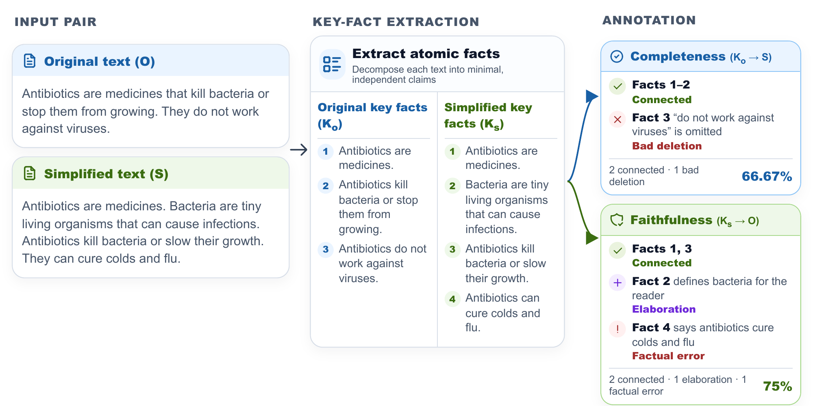

<h1 align="center">M<sup>2</sup>PRESERVE</h1>

<p align="center">
  A multidimensional framework for evaluating meaning preservation in text simplification.
</p>

<p align="center">
 <a href="#m2preserve-annotation-interface">Annotation Interface</a> | <a href="#m2preserveeval-dataset">Dataset</a> | <a href="#paper">Paper</a>
</p>

<p align="center">
  
</p>


---

## M<sup>2</sup>PRESERVE Annotation Interface

The M<sup>2</sup>PRESERVE annotation interface provides a web-based implementation of the framework described in the paper. It is used to collect fine-grained human annotations through key-fact alignment, supporting the two evaluation dimensions of **Completeness** and **Faithfulness**.

In **Completeness**, annotators check whether key facts extracted from the original text are preserved in the simplified text. In **Faithfulness**, annotators check whether key facts extracted from the simplified text are supported by the original text.

The interface allows annotators to upload annotation instances, align key facts with supporting sentences, assign labels to unaligned facts, add optional comments, and download the completed annotations. Downloaded files can be re-uploaded later to resume annotation.

**Live interface:**  
https://abdullahsalembar.github.io/M2Preserve/

**Source code:**  
[`annotation-ui/`](./annotation-ui/)

### Input Format

The interface expects a JSON file containing an `instances` field. Each instance includes the original text, simplified text, system name, source information, key facts, and a `displayType` field.

```json
{
  "instances": [
    {
      "id": "m2p_001",
      "idx": 1,
      "SystemName": "gemini-2.0-flash",
      "orginal": "The Nile is the longest river in Africa. It flows through several countries, including Egypt and Sudan.",
      "simplified": "[1] The Nile is a very long river in Africa.\n[2] It goes through Egypt and Sudan.",
      "source": "example",
      "displayType": "simplified",
      "keyFacts": [
        "The Nile is the longest river in Africa.",
        "The Nile flows through several countries.",
        "Egypt and Sudan are among the countries the Nile flows through."
      ]
    }
  ]
}
```

#### Input Fields

| Field | Description |
|---|---|
| `id` | Unique identifier for the annotation instance. |
| `idx` | Instance index. |
| `SystemName` | Name of the simplification system that generated the simplified text. |
| `original` | Original input text. |
| `simplified` | Simplified output text. |
| `source` | Source dataset or collection. |
| `displayType` | Annotation mode. Use `simplified` for Completeness and `original` for Faithfulness. |
| `keyFacts` | List of atomic key facts to be annotated. |

#### `displayType`

The `displayType` field controls which evaluation dimension is shown in the interface.

| `displayType` | Evaluation dimension | Key facts extracted from | Text used for alignment |
|---|---|---|---|
| `simplified` | Completeness | Original text | Simplified text |
| `original` | Faithfulness | Simplified text | Original text |

Use `displayType: "simplified"` when annotators need to check whether key facts from the original text are preserved in the simplified text.

Use `displayType: "original"` when annotators need to check whether key facts from the simplified text are supported by the original text.

### Notes

The interface runs fully in the browser and does not store annotations on a server. Annotators must save their progress by clicking **Save / Download** and keeping the downloaded JSON file.

---

## M<sup>2</sup>PRESERVEEVAL Dataset
The M<sup>2</sup>PRESERVEEVAL dataset will be hosted on Hugging Face:

```text
https://huggingface.co/datasets/cardiffnlp/M2PreserveEval
```
The dataset contains instance-level annotations for evaluating meaning preservation in text simplification using the M<sup>2</sup>PRESERVE framework. Each instance includes an original text, a simplified output, extracted key facts, alignment decisions, fine-grained annotation labels, and a final score.

The dataset is organised into two JSONL files:

```text
M2PreserveEval_Completeness.jsonl
M2PreserveEval_faithfulness.jsonl
```

Each JSONL line represents one annotated instance.

### Dataset Format

Each instance follows this structure:

```json
{
  "dimension": "completeness",
  "instanceidx": 0,
  "sourceName": "TSAR 2025 Shared Task on RCTS (British Council)",
  "source": "...",
  "simplified": "...",
  "keyFacts": ["..."],
  "System_Name": "gemini-2.0-flash",
  "score": 100,
  "Alignment": [1, 1, 1],
  "Labels": ["Connected", "Connected", "Connected"]
}
```

### Fields

| Field | Description |
|---|---|
| `dimension` | Evaluation dimension, either `completeness` or `faithfulness`. |
| `instanceidx` | Instance index. |
| `sourceName` | Name of the source dataset from which the original text was sampled. |
| `source` | Original input text. |
| `simplified` | Simplified text. |
| `keyFacts` | Atomic key facts extracted from the text. In completeness, they are extracted from the original text; in faithfulness, they are extracted from the simplified text. |
| `System_Name` | Name of the simplification model. |
| `score` | Final score for the evaluated dimension. |
| `Alignment` | Binary alignment values for the key facts. |
| `Labels` | Fine-grained labels for each key fact. Completeness labels include `Connected`, `good deletion`, `bad deletion`, and `Wrong Key Fact`; faithfulness labels include `Connected`, `elaboration`, `factual error`, and `Wrong Key Fact`. |

## Source Datasets

The instances are sampled from the following sources:

- [`cambridge_exams_en`](https://huggingface.co/datasets/UniversalCEFR/cambridge_exams_en)
- [`elg_cefr_en`](https://huggingface.co/datasets/UniversalCEFR/elg_cefr_en)
- [`OneStopEnglish corpus`](https://github.com/nishkalavallabhi/OneStopEnglishCorpus)
- [`TSAR 2025 Shared Task on RCTS (British Council)`](https://huggingface.co/collections/cardiffnlp/tsar-2025-shared-task-on-rcts)


---

## M<sup>2</sup>PRESERVE-LLM


---

## Citation

```bibtex

```
